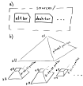

# Distribution

Mapterhorn's ready-to-use terrain PMTiles as well as the normalized source datasets are available for download free of charge.

The folder structure of the primary download server https://download.mapterhorn.com/ is:

```
/
├── download_urls.json
├── attribution.json
├── planet.pmtiles
├── ...
├── 6-33-21.pmtiles
├── 6-33-22.pmtiles
├── ...
└── sources/
    ├── at1.tar
    ├── desh.tar
    ├── ...
    └── usgs3dep13.tar

```

The file download_urls.json lists all available PMTiles files, see https://mapterhorn.com/data-access.

The file attribution.json lists all used sources, see https://mapterhorn.com/attribution.

The tiles are distributed over multiple PMTiles archives, see figure part b) below. The top of the pyramid is formed by the file planet.pmtiles which covers the entire planet on zoom levels 0 to 12. Higher zoom levels are stored in subpyramids named 6-x-y.pmtiles. Their minzoom is 13 with a variable maxzoom; some go only to zoom 14, others up to 17. The subpyramids each cover an area corresponding to a zoom 6 Web Mercator tile, hence the name.




## Mirrors

Mapterhorn's data can be mirrored to alternative download servers. This improves data availability during outages and reduces the risk of data loss.

Mirrors can hold copies of the entire dataset including all PMTiles archives and source tarballs, or they can also just store a subset of the data for example for a geographic region of interest.

To set up a Mapterhorn mirror follow these steps:

1) Copy the files of your choosing from the primary download server to your mirror. This can for example be done with the help of the [mirror.py](mirror.py) script.
2) Make a Pull Request where you add the details of your mirror to [mirrors.json](mirrors.json).

Once your Pull Request is merged we will run the mirrorstatus.py script which checks which files are available on your download server. The result of this scan will then be visible on https://mapterhorn.com/data-access

If you have any questions about how to set up a mirror feel free to ask in a GitHub Issue.
