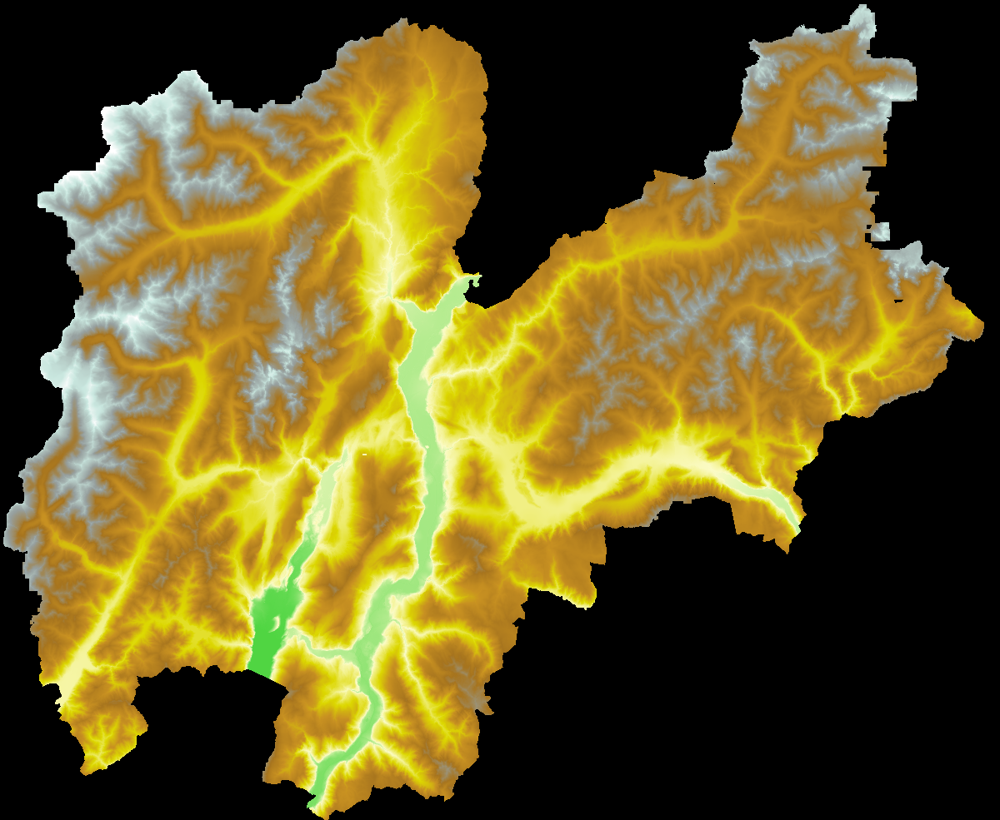

# Trento DTM

## Build pipeline

The file trento_dtm.tif was built from multiple survey result (2009, 2012, 2014/2018) using the following notebook:
[nbviewer.org](https://nbviewer.org/github/eslopemap/eslope/blob/main/development/Central-Alps-dwn-Trentino.ipynb)

## Source data information

From the *Portale Geografico Trentino*: [territorio.provincia.tn.it](http://www.territorio.provincia.tn.it/portal/server.pt/community/lidar/847/lidar/23954)

From the European Union Geoportal: [inspire-geoportal](https://inspire-geoportal.ec.europa.eu/srv/api/records/p_TN:9f2cc32d-1030-430d-be85-7f95c9cc24ea)
